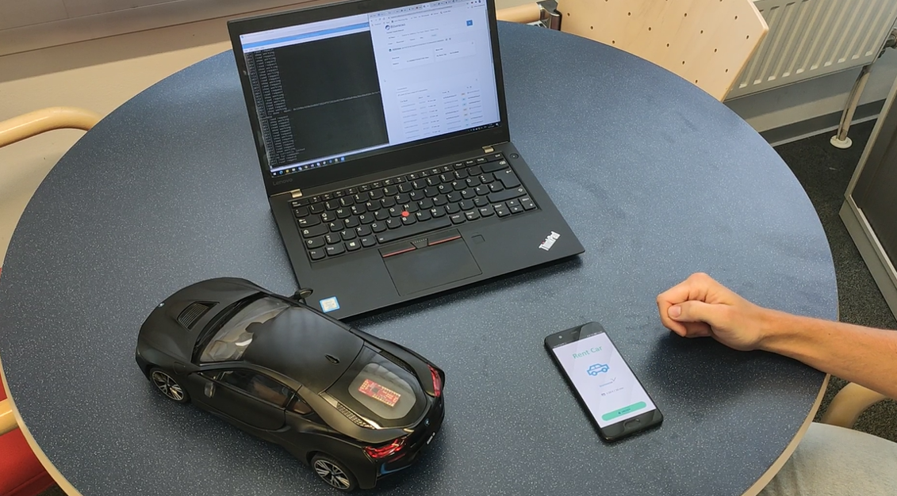
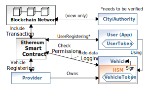
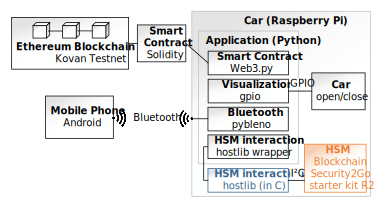
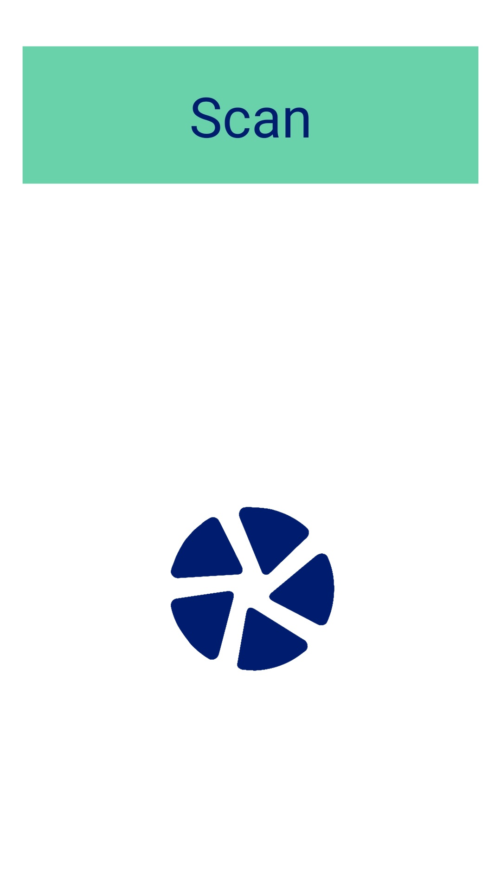
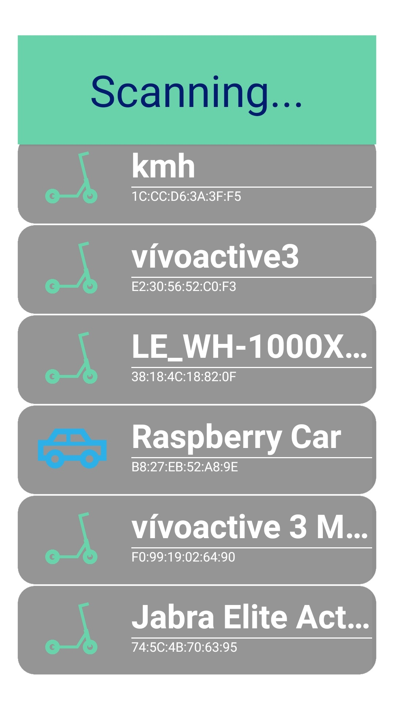
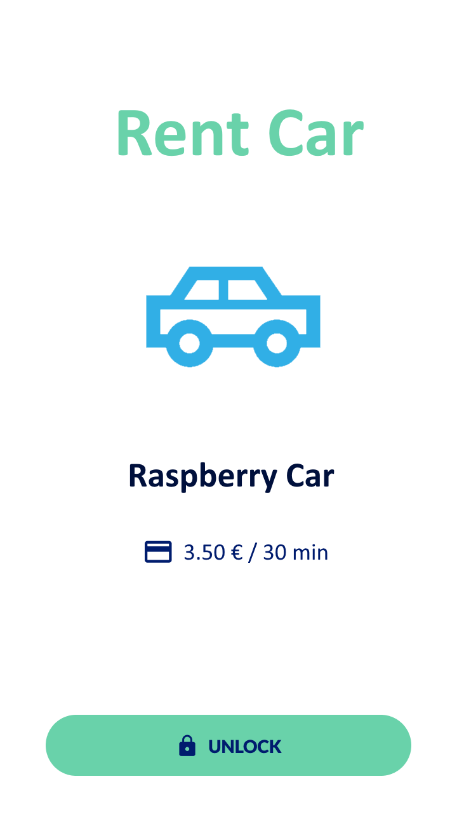
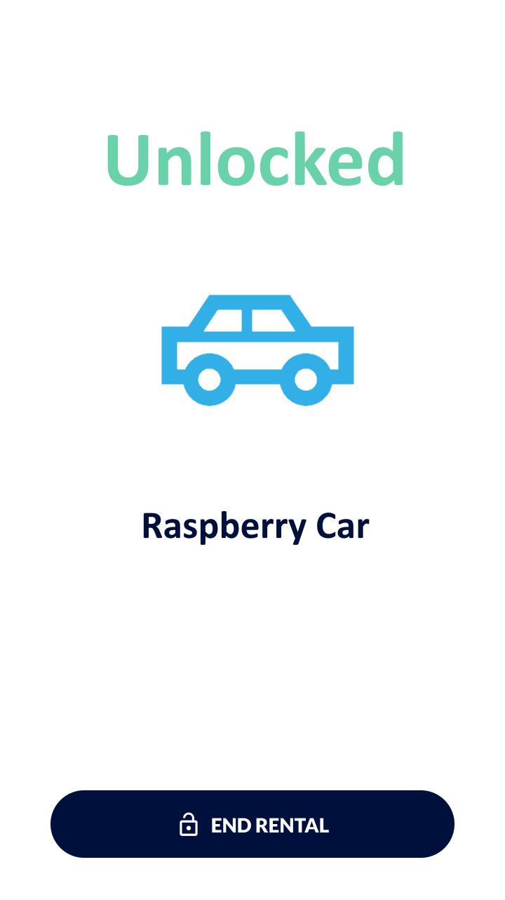
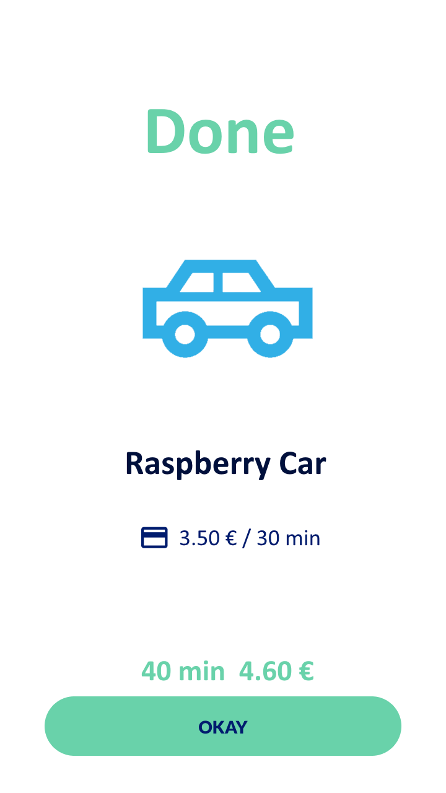
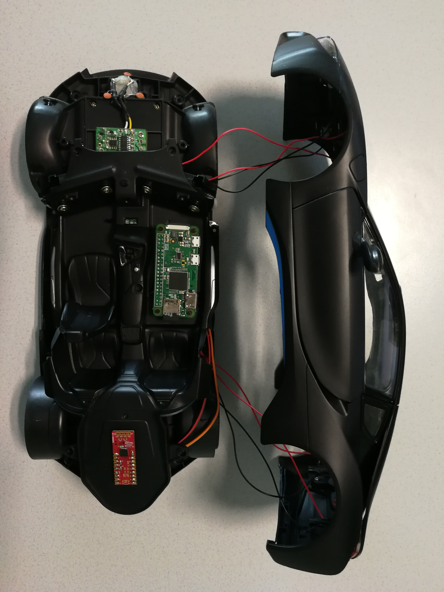
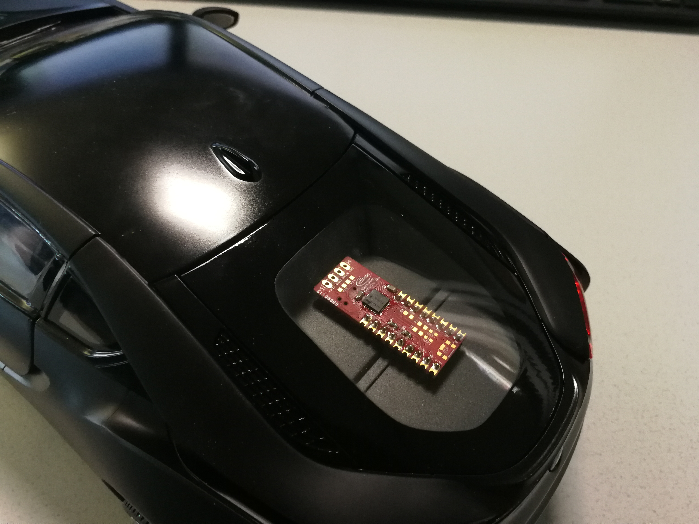

# Shared Mobility Demo

Shared mobility is gaining momentum in recent times, especially in urban areas. The patchwork of new mobility providers and new modes of transport is rapidly growing. Therefore, also the amount of mobile applications required for the end user and the corresponding number of account registrations, to get most out of this ecosystem, is growing. On the other hand, big providers are also rapidly growing, which potentially results in monopolism. The use of blockchain allows to circumvent both problems in this field of application. This comes with the necessity to protect the corresponding key material. This demonstrator utilizes *Infineon's Blockchain Security 2Go Starterkit R2* and parts of its functionality.

## Table of Content
  * [Demo Video](#demo-video)
  * [Concept](#concept)
  * [Architecture](#demo-architecture)
  * [Mobile Application](#mobile-application)
  * [Step-by-Step Instructions](#step-by-step-instructions)

## Demo Video

This video gives an overview of the demonstrator, consisting of the three main parts:
* Toy car (Raspberry Pi - Python application)
* Smart phone (Android application)
* Ethereum Blockchain Public Test net (Kovan)

<a href="https://e.video-cdn.net/video?video-id=3wvhUT32zbfnUW2fj7gGjP&player-id=E9W5foaMoUuxrto5-fGaPP&channel-id=37319">

 https://e.video-cdn.net/video?video-id=3wvhUT32zbfnUW2fj7gGjP&player-id=E9W5foaMoUuxrto5-fGaPP&channel-id=37319

## Concept

The proposed concept is based on an Ethereum blockchain and a smart contract implemented in *Solidity*. The involved parties in the shared mobility ecosystem are:
* Vehicle provider
* Vehicle
* User
* City/Authority

The providers still own their vehicles as usual, but they need to be registered in order to make them accessible via the blockchain This is done via the smart contract, resulting in a vehicle token (ERC-721 token).

Important here, for the vehicles *Infineon's Blockchain Security 2Go Starterkit R2* is utilized to store the link to the token securely. In detail, a vehicle token is assigned to a public available key (representing an address), which is associated to the private key (stored on the secure element), to prove the ownership of the vehicle token. This makes it impossible to clone or tamper with vehicle information. 
The end user has to be registered as well, but no private data is stored on the blockchain, just a link to the user, represented by a user token which is defined in the smart contract. This works analogously to the vehicle token generation. Details about the verification of the user information is out of scope for this demonstrator.

After the setup phase, registered vehicles are ready to use. In order to do so, the permissions are checked in the smart contract. e.g. is the user registered, is the vehicle registered, and does the user have the permissions to drive this vehicle. If all valid and proved, the trip data is logged. Exactly this trip data could be used by the city to gain valuable insights about their citizens mobility behaviour and the shared mobility situation in general. 

## Demo Architecture

The demonstrator architecture is depicted in the following figure and mainly consists of a toy car equipped with a *Raspberry Pi Zero W* running a Python application, and a smart phone running an Android application.

A Ethereum blockchain was hosted with *Kovan Testnet* and the smart contract was published with *Remix*. For interaction of the toy car and the smart contract the *Web3.py* library was utilized. For visualizing the (un)locking procedure, the wing doors of the toy car are opened and closed respectively, triggered with respective Raspberry Pi GPIO values. 

The (un)locking procedure is triggered with the smart phone explained in the [Mobile Application](#mobile-application) section.

To interact with *Infineon's Blockchain Security 2Go Starterkit R2*, a wrapper for the host library which is available in C, was implemented. See lib *blocksec2go* (TODO: add link). The functionality of *Infineon's Blockchain Security 2Go Starterkit R2* was not fully exploited for this demonstrator, but the following was utilized:
* *block2go_select(...)*
* *block2go_generate_key_permanent(...)*
* *block2go_get_key_info_permanent(...)*
* *block2go_generate_signature_permanent(...)*

The protocol stack is not depicted in detail in the figure above, but it consists of a Raspberry Pi I2C driver, and an APDU protocol implementation.

## Mobile Application

The mobile application is written for Android. It is only searching for Bluetooth devices in the vicinity of the smart phone, and displays them in a list. All devices with a given string within the device name are shown as cars (e.g. *Raspberry Car*). If this device offers a specific Bluetooth characteristic, it is possible to connect, respectively unlock this device. 

The steps performed during interacting with the smart phone application are: 
* Prerequisite: Turn on Bluetooth and location services
* Scan for devices
* Select *Raspberry Car*
* Unlock the device
* Wait until:
    * Permissions are checked
    * Transactions is generated
    * Transaction is signed
    * Signed transaction is included in new block
    * Unlock screen appears (in success case)
* Lock the device (see steps from *Unlock*)
* Done

The apk can be found in the corresponding source folder ([src/android_application](src/android_application)/velink.apk).

  
   
  
  
  
  

The application is scanning for devices in the vicinity, but the details (e.g. price, user public key) are hardcoded within the app. The Bluetooth scanning functionality was adopted from https://github.com/tutsplus/Android-BluetoothScannerStarterProject.

## Hardware Setup

The hardware setup of the demonstrator consists of:
* Extended toy car
  * Jamara 404570 BMW I8 1:14 RC Einsteiger Modellauto Elektro Straßenmodell
  * Raspberry Pi Zero W
  * *Infineon's Blockchain Security 2Go Starterkit R2*
  * LB1938FA (H-bridge motor driver)
  * Battery pack
* Smartphone (Android)

*Infineon's Blockchain Security 2Go Starterkit R2* was connected to the Raspberry Pi via I2C. The H-bridge is driving the motors for opening and closing the door, triggered by the GPIOs of the Raspberry Pi. 

  
   
  
  

## Step-by-Step Instructions

To play around with and reconstruct the demonstrator, several steps have to be performed before running the applications on smart phone and Raspberry Pi. Please note, the I2C interaction requires sudo privileges.

1. Minimal hardware setup
    1. Raspberry Pi
        1. Install OS (e.g. Raspbian)
        1. Internet connection required
    1. Doxygen und Catch2 (version 2) are dependencies for this repo (to get rid of the warnings)
    1. Connect *Infineon's Blockchain Security 2Go Starterkit R2* via I2C (3.3V, GND, SDA, SCL)
    1. (Optional) Connect H-bridge motor driver to GPIO pins 15 and 16,  and LEDs to GPIO pins 35 to 38 (see [visualization.py](src/rpi_application/src/application/visualization.py))
1. Build C source code with *cmake* 
    1. See [Requirements](src/rpi_application/README.md#requirements)
    1. See [Build Instructions](src/rpi_application/README.md#build)
1. Generate key pair and derive the vehicle's wallet address
    1. Run [setup_gen_key_pair.py](src/rpi_application/src/application/setup_gen_key_pair.py) (with sudo)
    1. Remember output *key slot* and *Vehicle Address*
    1. Fund Kovan test Ethers to vehicle address using [Kovan Faucet](https://faucet.kovan.network)	
    1. Set variable *key_slot* to corresponding value in [smart_contract_interaction.py](src/rpi_application/src/application/smart_contract_interaction.py)
1. Generate vehicle token and transfer it to the vehicle's wallet address
    1. Run [setup_gen_vehicle_token.py](src/rpi_application/src/application/setup_gen_vehicle_token.py) (with sudo)

1. Run [main.py](src/rpi_application/src/application/main.py) (with sudo)
1. Install Android application on smart phone ([velink.apk](src/android_application/velink.apk))
1. Start Android application on smart phone (see steps [Mobile Application](#mobile-application))

